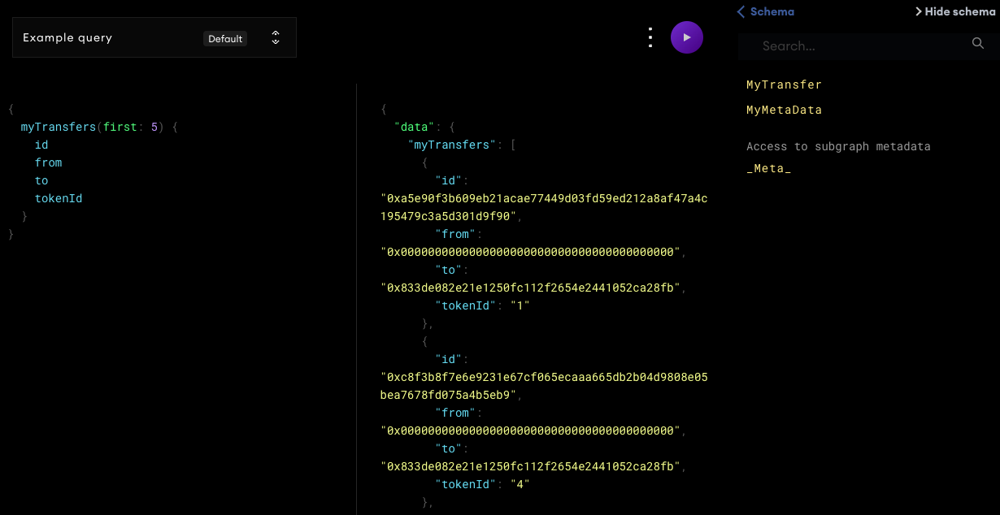

# LJ Subgraph NFT Explorer
```
索引合约事件，进一步对链上数据再封装，便于直接查询
```




## 安装Graph CLI

```
npm install -g @graphprotocol/graph-cli
```

## 创建SubGraph

```
graph init \
  --product hosted-service  \
  --from-contract 0x9b6dbE875D970F5FB0e0ADF9B33E2C0f6692Df5b \
  --network rinkeby \
  --abi NFTExplorer.json \
  flash-meta/Explorer666
```

## 定义存储结构

```
schema.graphql
```

## 存储结构生成对应的ts代码

```
graph codegen
```

## 事件逻辑处理

```
nft-explorer.ts
```

## 编译
```
graph build
```

## 部署
```
graph auth --product hosted-service <ACCESS_TOKEN>
graph deploy --product hosted-service flash-meta/Explorer666
```

## 问题
```
部署错误:
The feature `ipfsOnEthereumContracts` is used by the subgraph but it is not declared in the manifest.
subgraph.yaml加上:
features:
  - fullTextSearch
  - ipfsOnEthereumContracts
 
ipfs.cat错误:
ipfsPath is ipfs://QmSZmXKcfC9WgFewoGCgRpjfaHxSDxA54BCVZGhm8y72Zx/1, data_source: NFTExplorer
Failed ipfs.cat, returning `null`, error: HTTP status server error (500 Internal Server Error) for url (http://10.0.1.215/api/v0/files/stat?arg=/ipfs/ipfs://QmSZmXKcfC9WgFewoGCgRpjfaHxSDxA54BCVZGhm8y72Zx/0), link: ipfs://QmSZmXKcfC9WgFewoGCgRpjfaHxSDxA54BCVZGhm8y72Zx/0
```